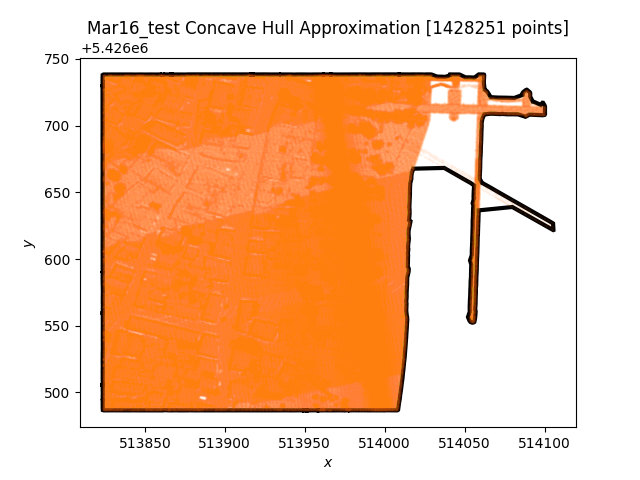

[](https://github.com/EthanJamesLew/concave-hull/actions/workflows/rust.yml)
[](https://github.com/EthanJamesLew/concave-hull/actions/workflows/Maturin.yml)

# Fast Concave Hull

This is a fast implementation of concave hull using a k-nearest neighbour approach.



*Concave Hull on LiDAR Point Cloud Data with over 1M points. The calculation took 2.88 seconds to run.*

## Implementation Details

The current implementation is based on the paper

> Moreira, A., & Santos, M. Y. (2007). Concave hull: A k-nearest neighbours approach for the computation of the region occupied by a set of points.

The algorithm has a parameter $k$, the number of neighbors, and controls the "smoothness" of the hull.

## Setup Rust

Use Cargo 

```shell
cargo build
```

## Setup Python (Development)

Use PyO3 + Maturin

```shell
maturin develop
```